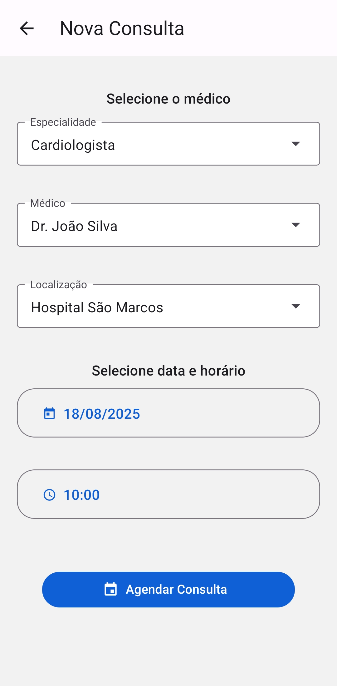
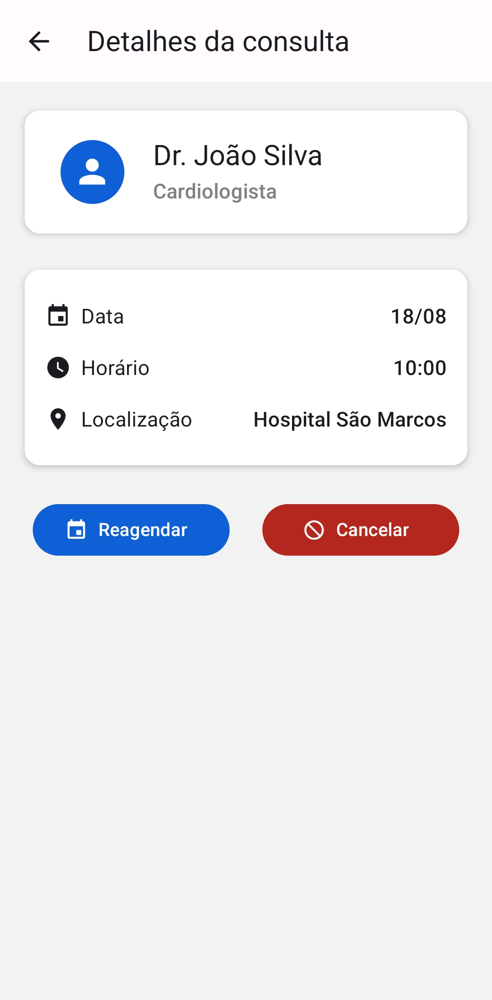

# 📱 MedClub

Protótipo de aplicativo mobile para gerencimento de consultas médicas.

## 📸 Screenshots

<div style="display: flex; justify-content: space-evenly;">
    
    
    
</div>

## 🚀 Funcionalidades

* 📋 Listagem de consultas agendadas por status (próximas, passadas e canceladas)

* 🔍 Visualização dos detalhes da consulta (data, hora, médico, especialidade, localização)

* ➕ Agendamento de novas consultas

* ❌ Reagendamento e cancelamento de consultas existentes

Funcionalidades extras

* ✔️ Validação de formulário

* ✔️ Ordenação e agrupamento de consultas por data

* ✔️ Persistência de dados com AsyncStorage

* ✔️ Estado vazio com mensagem e botão de ação

## Tecnologias utilizadas

* React Native

* Expo

* Typescript

* React Native Paper (Material Design)

* React Navigation

* Context API para gerenciamento de estado

## ▶️ Como rodar o projeto

### Pré-requisitos

* Node.js >= 20

* npm ou yarn

### Passos

1. Clone o repositório:

```
git clone https://github.com/guisantosfr/medclub-teste.git
cd medclub-teste
```

2. Instale as dependências

```
npm install
```

3. Inicie o app

```
npm start
```

4. Execute no emulador ou dispositivo físico (via Expo Go ou Android Studio)

## 👨‍💻 Autor

[Guilherme Santos](https://www.linkedin.com/in/guisantosfr/)